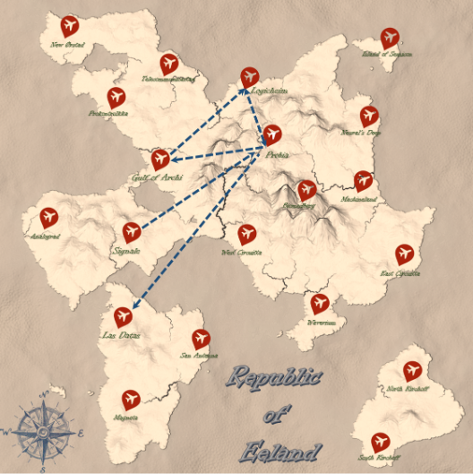

# EE Airlines Route and Flight Management System

## Overview
This project is a comprehensive C++ implementation designed to manage the intricate operations of EE Airlines, a fictional air travel company operating within the Republic of Eeland. The system is built on advanced graph data structures to efficiently handle routes, flights, and various airline management tasks such as adding or removing cities, routes, computing flight plans, and optimizing airline operations based on occupancy rates and profitability. This project is part of the Data Structures course at METU.

## Features
- **Graph-Based Route Management:** Utilizes directed graphs to represent and manage airline routes between cities.
- **Dynamic Flight Plan Generation:** Dynamically generates flight plans based on route maps, incorporating unique flight numbers and scheduling.
- **Operational Efficiency Optimization:** Implements algorithms to optimize routes and flights, including the addition of new routes and adjustment of flight prices based on occupancy rates.
- **Comprehensive Management Operations:** The system includes functionalities for scheduling flights, adjusting prices, managing aircraft allocations, and analyzing route performance. It also offers tools for scenario analysis, allowing the airline to simulate the impact of changes in the route network, pricing strategies, and flight schedules on overall operations.
- **User-Friendly Operations:** Provides intuitive functions for airline staff and third parties for tasks such as scheduling, pricing, and canceling flights.
